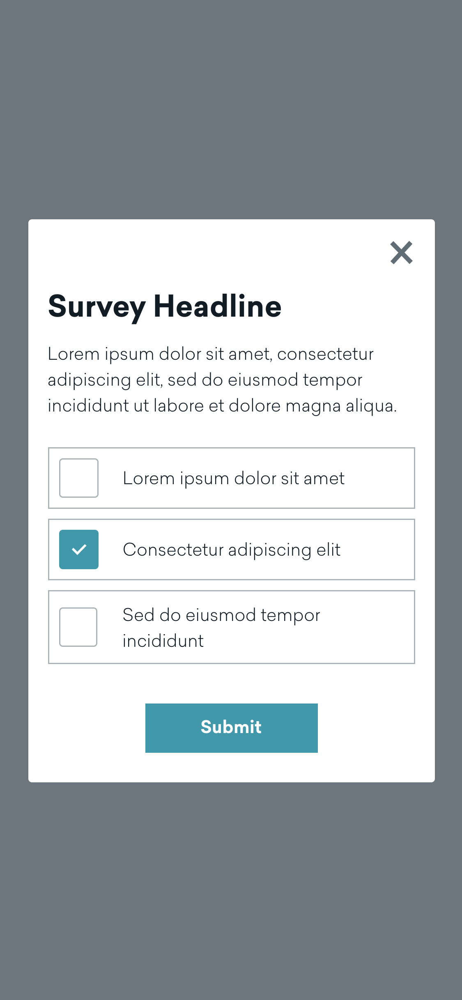
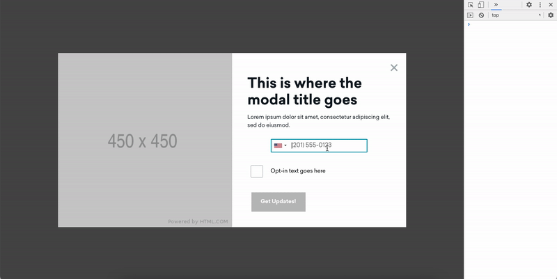
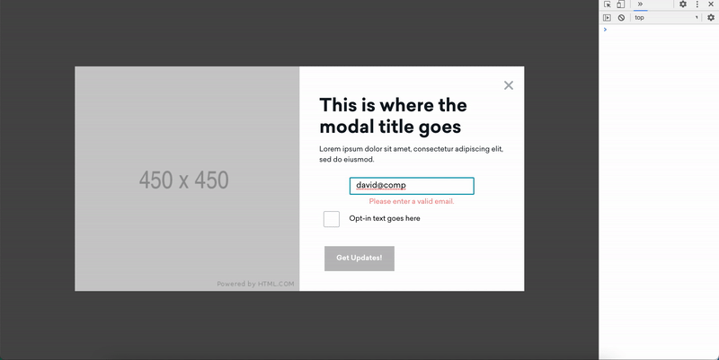
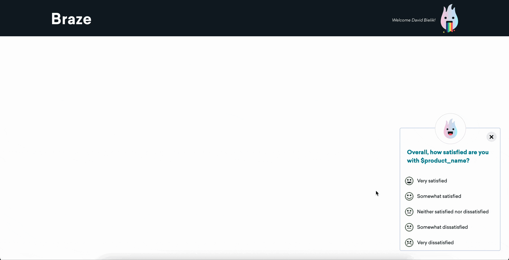

# 🚀 Braze now supports a Drag-and-Drop visual editor!

#### This repository is no longer maintained. Please use the new [drag-and-drop in-app message editor](https://www.braze.com/docs/user_guide/message_building_by_channel/in-app_messages/drag_and_drop) instead.

===============

# Overview

Use Braze to create fully customizable in-app and in-browser messages using HTML, in both mobile apps and web browsers. 

This respository contains templates from Braze and the Braze customer community to help you getting up and running with custom HTML messages. 

For more information on how to customize your Braze HTML In-App Messages, see our [Documentation][6].

# Getting Started

1. Choose a template from the list below, or browse the full list of [Braze Templates][8] or our [Community Templates][7].

2. Copy the HTML file's contents into your Braze Custom HTML message

3. Share your success and contribute your own custom HTML templates

| :construction: Please be sure to use assets hosted in the Braze Media Library to ensure proper offline support for messages. |
| --- |

# Message Templates

## Braze Templates

The following templates are all mobile and desktop responsive! Simply swap out the image placeholders, add text and links, and launch!

| Name | Platforms | Description | Screenshot |
|:-----|:---------|:------------|-----:|
| [Braze Carousel Modal][101] | :iphone: :computer: | Swipe through multiple pages of images and text | [][101]|
| [Braze Simple Modal][102] | :iphone: :computer: | A single image and text modal | [][102] |
| [Braze Survey Modal][103] | :iphone: :computer: | A survey templates which logs custom attributes for retargeting. | [][103] |
| [Braze SMS Modal][104] | :iphone: :computer: | Collect phone numbers to use with Braze SMS. | [][103] |
| [Braze Email Capture Modal][105] | :iphone: :computer: | Collect email addresses to use within Braze. | [][103] |
| [Braze NPS][106] | :computer: | NPS Survey for quantitative and qualitative feedback. | [][106]

## Community Gallery

We have the most creative customers, so we've put together a place to contribute to Community Templates!

[Click here][7] to learn more and browse our Community Templates.

## Legacy Templates

To view our legacy templates which used `.zip` files, [click here][5].

[1]: https://github.com/Appboy/Custom-HTML5-In-App-Message-Templates/tree/master/DeprecatedTemplates
[2]: https://www.braze.com/docs/user_guide/message_building_by_channel/in-app_messages/customize/#javascript-bridge
[3]: https://www.braze.com/docs/user_guide/message_building_by_channel/in-app_messages/beta-preview/
[4]: https://www.braze.com/docs/user_guide/message_building_by_channel/in-app_messages/testing/
[5]: https://github.com/Appboy/Custom-HTML5-In-App-Message-Templates
[6]: https://www.braze.com/docs/user_guide/message_building_by_channel/in-app_messages/customize
[7]: community-templates
[8]: braze-templates
<!-- template folders -->
[101]: braze-templates/1-braze-dashboard-carousel-modal
[102]: braze-templates/2-braze-dashboard-simple-modal
[103]: braze-templates/3-braze-dashboard-survey-modal
[104]: braze-templates/4-sms-capture-modal
[105]: braze-templates/5-email-capture-modal
[106]: braze-templates/6-braze-nps
