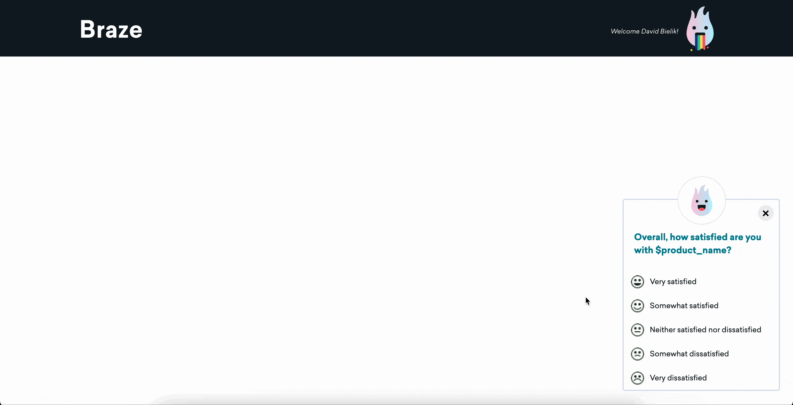

# Instructions

Replace the following variables to customize your NPS Survey:

| variable         | description                                                                             | required? |
| ---------------- | --------------------------------------------------------------------------------------- | --------- |
| `SURVEY_ID`      | This ID will be used to log a custom event and custom attribute upon survey submission. | Yes       |
| `QUANT_QUESTION` | The initial question presented in the survey.                                           | Yes       |
| `QUAL_QUESTION`  | The followup question presented with a feedback textarea.                               | No        |
| `AVATAR_IMAGE`   | An optional image to display on top of the survey.                                      | No        |
| `THANKYOU_TEXT`  | The "Thank You" message displayed after completing the survey.                          | No        |
| `SUBHEADER_TEXT` | An optional smaller text to display underneath the initial question.                    | No        |
| `CHOICES`        | An ordered list of choice names. You can remove choices for fewer options.              | No        |

