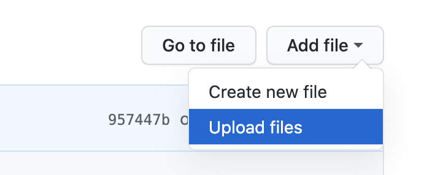

Community Templates
==========

We've love for you to share templates you've used with the rest of the Braze community!

Follow the steps below to add your own HTML template:

## Adding a Custom Template

1. Click `Add File > Upload Files` in the top right corner of the Community Templates page

2. Upload a __new folder__ which contains the `index.html` file, a screenshot, and any required assets.

3. Create a new Pull Request for Braze to review
